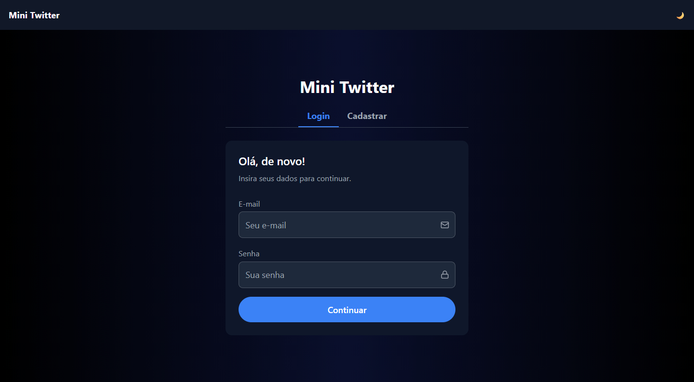
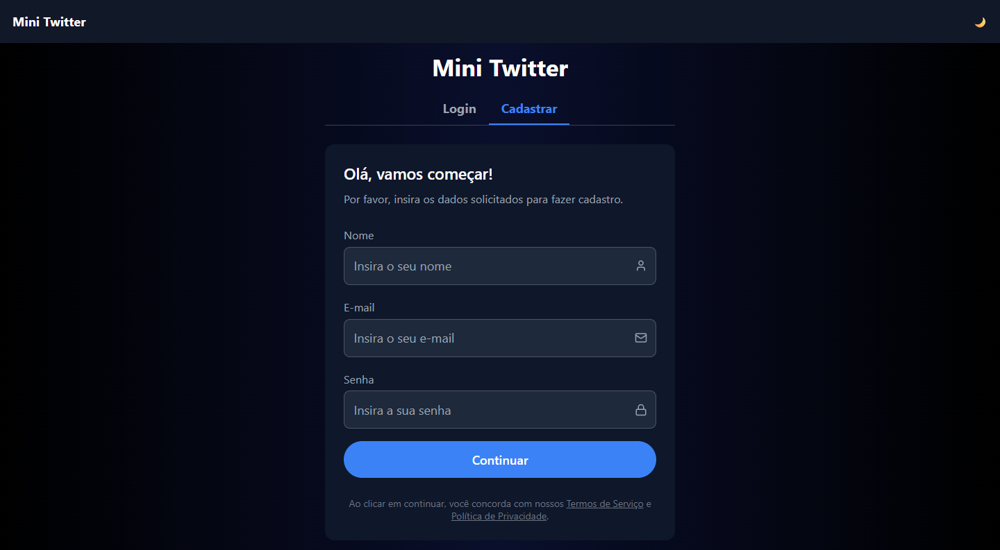

Mini Twitter

🧠 Sobre o projeto

O Mini Twitter é uma aplicação frontend que simula uma rede social simples, permitindo autenticação de usuários e interação com posts em tempo real.

O foco do projeto foi criar uma aplicação com boa experiência do usuário, organização de código e práticas modernas de desenvolvimento frontend.

🛠️ Tecnologias utilizadas

React

TypeScript

Axios

TanStack Query (React Query)

React Hook Form

Zod

Tailwind CSS

✨ Funcionalidades
🔐 Autenticação

Login de usuário

Cadastro de usuário

Persistência de sessão com JWT

Proteção de rotas

📝 Posts

Listagem de posts (timeline)

Criação de novos posts

Curtir posts

Atualização automática da lista

🔍 Experiência do usuário

Scroll infinito

Dark mode

Feedback visual (loading, erros e sucesso)

Skeleton loading

Interface responsiva

UI baseada no protótipo do Figma

🎨 Diferenciais implementados

Estrutura de projeto organizada por responsabilidades

Componentes reutilizáveis (Input, Button, etc.)

Tratamento de erros com feedback ao usuário

Interface moderna com Tailwind CSS

Uso de React Query para cache e sincronização de dados

⚙️ Como rodar o projeto

# Instalar dependências

npm install

# Rodar o projeto

npm run dev

A aplicação estará disponível em:
http://localhost:5173

🌍 Deploy

[Acessar projeto](https://test-mini-twitter.vercel.app/register)

📸 Preview

👨‍💻 Autor

Desenvolvido por Kaynan Teixeira

📧 kaynanldev@gmail.com

💬 Observações

Além dos requisitos solicitados, foram implementadas melhorias focadas em experiência do usuário e organização do código, buscando simular um ambiente real de desenvolvimento.
